# Storage Solutions for Big Data - Group Assignment

This repo was created to provide the infrastructure for our Group Assignment for module 'Storage Solutions in Big Data' as apart of our course Higher Diploma in Artificial Intelligence (part time).

This README aims to outline our infrastructure, deployment architecture and some development practices.

## Team members:
Name          | Student No.
------------- | -------------
Cristina Blanco  | sba20182
Stephen Brennan  | sba20180
David Fagan  | sba20183
Aisling Maher  | sba20318

# Overview

We forked from https://github.com/RWaltersMA/mongo-spark-jupyter to give us the base infrastructure.

This provided us with a 3 Spark cluster consisting of a Spark Master and 2 Spark Workers, 3 MongoDB containers and a Jupyterlab container.

The decision to fork this repo was based on the fact it used docker containers networked together and most importantly used mongodb as the database.

We needed to use mongodb as our betfair data was in json format.

## Architecture

Once we had the base architecture we added a script to load in our data, an additional spark worker (so all team members would have a worker) and another docker container for MySQL to store the results from our analysis.

As can be seen from the below, in the end we had 9 docker containers running and networked together. A future improvement might be to split this architecture over multiple VMs, such as having MongoDB containers in 1 VM, Spark containers in a 2nd VM and finally Jupyterlab and MySQL containers in a 3rd light VM.

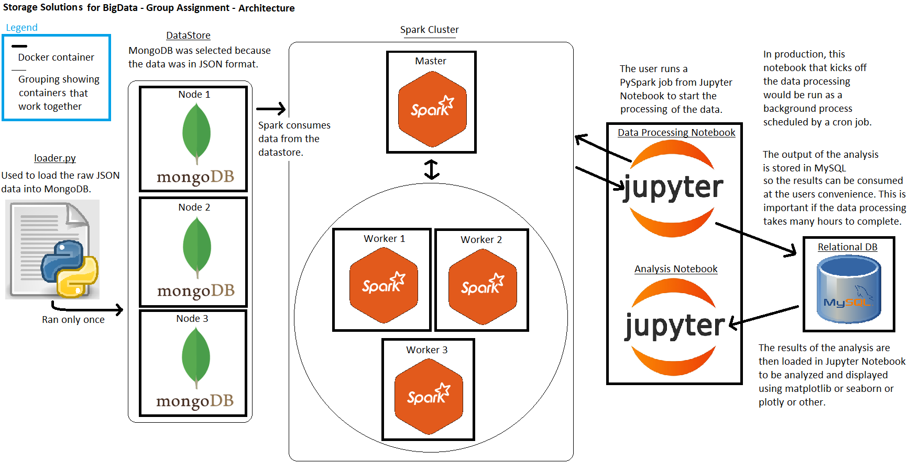

# Why docker?

We chose docker because we knew we could have a single github repository that gave us a central place for our infrastructure files that can be easily shared.

Because docker runs on Windows, MacOS and Linux, this gave us an easy way to replicate the same environment across the teams laptops and on our production Google Cloud Platform (GCP) Virtual Machine (VM).

The alternative was VirtualBox, however, prior experience thought us that everyone might have slightly different setups across the team and there was no straightforward way to push a VirtualBox VM onto GCP.

We were able to use docker volumes to persist our notebooks, mongodb and mysql databases between docker restarts.

Our docker containers were able to communicate on our docker network 'localnet'.

# Google Cloud Platform Virtual Machine

We wanted something more powerful to run our setup on than our local laptops could provide.

We settled on GCP because of our prior knowledge, its ease of use and the $300 free starting credit Google give you.

Our GCP VM spec was: Ubuntu 18.04 LTS, 8 vCPUs, 32GB RAM, 100GB SSD. The monthly cost is ~$220.

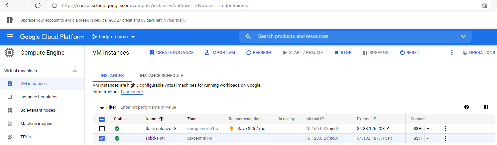

htop

As can be seen below, the GCP VM is being pushed hard, three spark workers are using the 8 vCPUs, all the availbe RAM is consumed and the VM is now eating into the 10GB of SWAP memory we added.

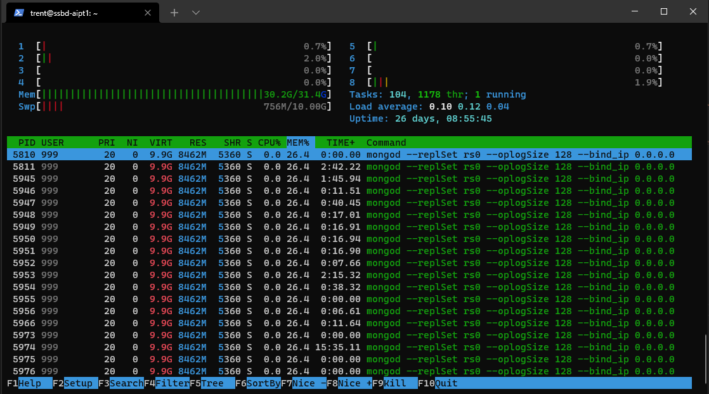

On this VM we installed miniconda and docker. Within a conda environment we git cloned our repo, installed the needed libraries and used 'docker-compose up' to run our environment.

GCP conda info

Docker containers

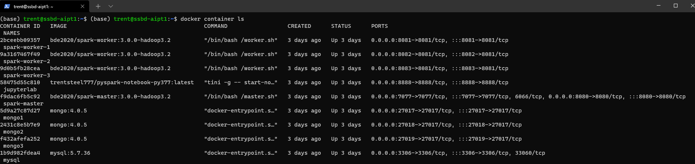

Our GitHub repo on our GCP VM

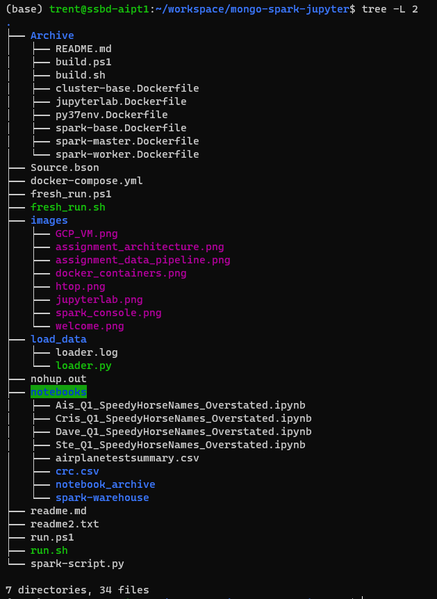

We added two rules in our firewall to allow jupterlab running on port 8888 traffic through from external locations. We also did the same for 8080, which is the port Spark Console was running on.

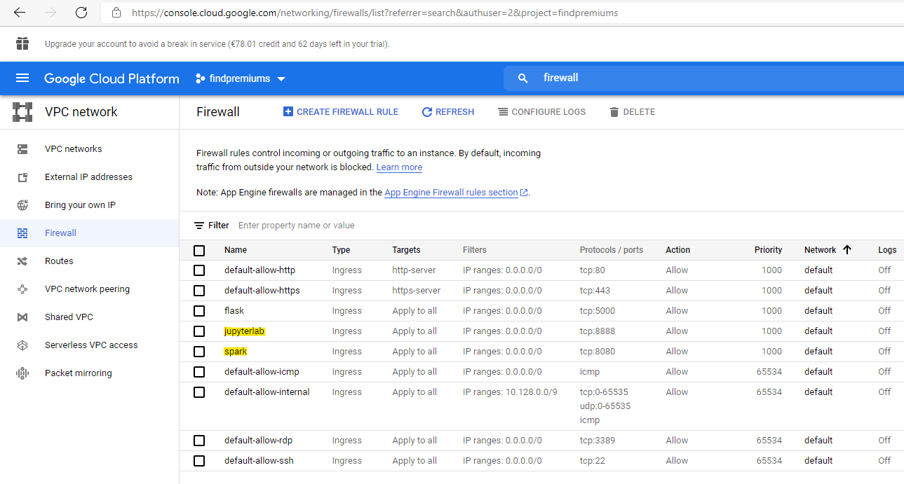

Jupyterlab

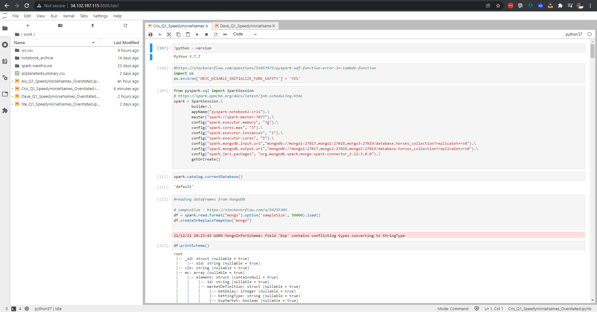

Spark Console

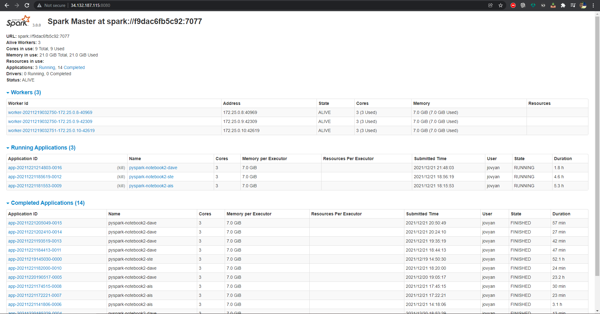

# Loading the data

To load the data we created loader.py script.

We downloaded the horse racing for 2016 from Betfair and unzipped the file.

The unzipped folder named 'BASIC' contained a series of bz2 zipped files. 

We ran our script over these bz2 files and loaded every line, which represented a JSON object, straight into MongoDB.

We added a logger to loader.py so we could tail loader.log as the script worked to assess it's progress (tail -100f loader.log).

Link to Betfair horse racing data spec: https://historicdata.betfair.com/Betfair-Historical-Data-Feed-Specification.pdf

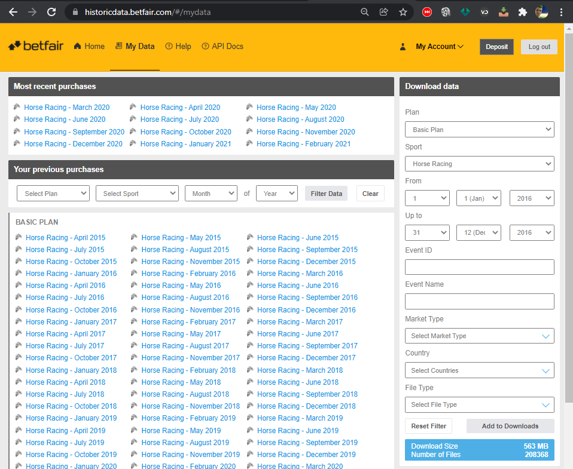

Even though we downloaded all available betfair horse racing data from Apr 2015 to Nov 2021, we only loaded 2016's data into mongodb. 

This was primarily because of performance concerns. 

We thought it might take too long to analyze years worth of data on the VM when we considered how long it took to analyze three months of data on one of laptops (which had 4 CPUs and 16GB of RAM).

Betfair data folders

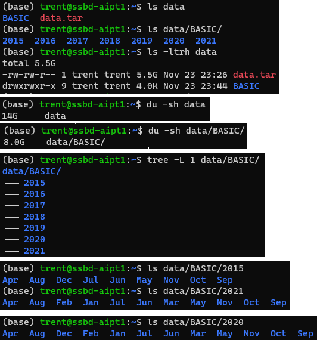

Betfair data files

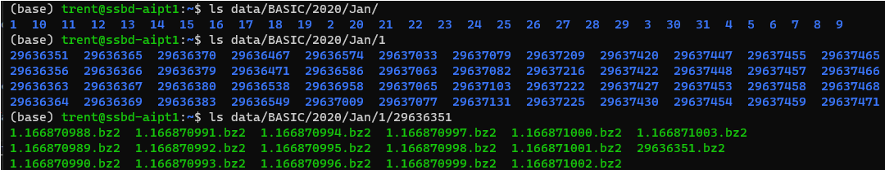

# VS Code - IDE

We installed our SSH keys into the GCP VM, both for our local machines and also GitHub.

This allowed us to connect using VS Code to the GCP VM and do some remote development!

We love using vim as much as the next Big Data expert but sometimes having a Graphical IDE at your disposal speeds things along and allows you to see more of the file system.

In the image below you can see VS Code has used our SSH key to connect to GCP VM and we can see all the file system in /home/trent and from there access and edit any files.

We also have the ability to open multiple terminals. In the bottom left you can see VS Code is connected via SSH.

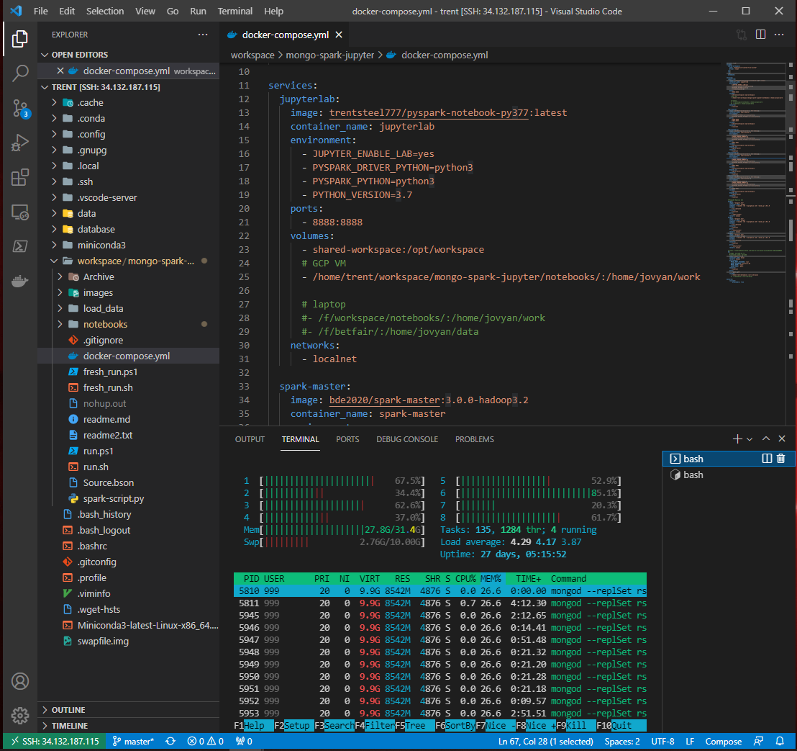

Because we added our GitHub SSH keys to the GCP VM, once we finished changing and tweaking our files we can easily commit and push them into our GitHub repo.

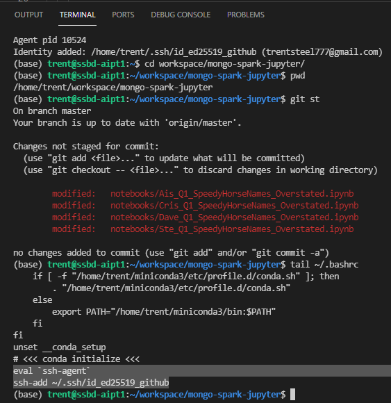

We changed our ~/.bashrc file to automatically add our GitHub SSH key when we open a new terminal. See the last few lines in the above screenshot.

# Troubleshooting
## Image versions Issue

When we first forked this repo the latest version of all the docker images was being used from dockerhub: jupyter/pyspark-notebook, bde2020/spark-master, bde2020/spark-worker and mongo:latest. Rather than giving us the latest and greatest of the new version this actually ended up causing big issues because of incompatible version mismatches.

We ultimately discovered the reason for this was that the original repo had it's last commits over a year ago at the time and back then all of the latest above mentioned images must have had versions that played nicely together.

We discovered the version mismatch issue by trying to run some pyspark code which resulted in an illegal reflective access Exception. After some Googling and tailing the docker containers with  'docker logs --tail 500 --follow --timestamps spark-worker-1' (and other containers too) we pin pointed the issue.

To solve the problem we thought to ourselves, a year ago when the original repo was created everything must of obviously worked. So we dug into the tags on dockerhub and only through experimentation finally found all the tags from a year ago which would 100% be compatible with each other.

We settled on the below tags for each image.

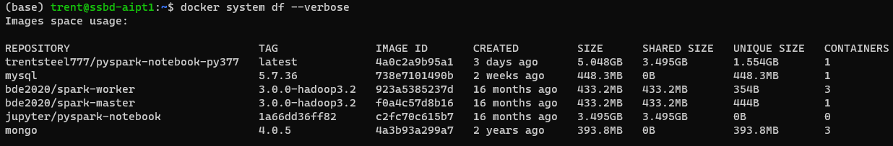

## Docker network

When we first started running the docker containers we only had two spark workers. After tailing the logs on the second one there was an apparent error that it could not connect to the 'spark-master'. spark-worker-2 could not find this host. After some combing through the docker-compose file we realised there was missing configuration.

'networks' property for spark-worker-2 was missing from the config, so we added this is and gave it the value 'localnet', exactly like spark-worker-1, so now spark-worker-2 could talk to the rest of the containers on the docker network! After we did this update spark-worker-2 successfully connected to spark-master. 

## SWAP Memory

When using loader.py to add the horse racing data into MongoDB the 32GB of RAM we had started getting fully and fully. At the time we had no assigned swap memory and from past experience we had been told if a machine exceeds its RAM and has no SWAP it will just crash. So while the RAM was getting fully we scrambled to add in some SWAP to prevent the machine crashing.

No swap; machine running out of RAM as we loaded in our data

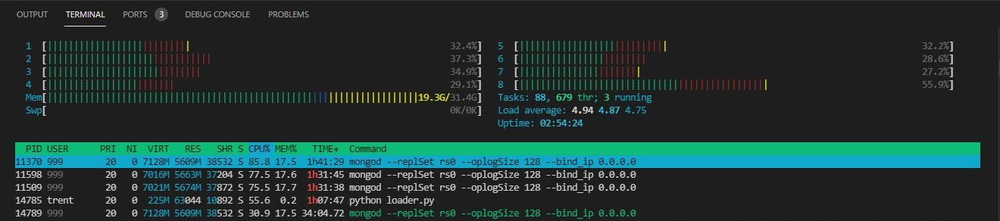

Added SWAP just in time. For loading data we added 15GB, but we ultimately only saved 10GB of SWAP space in the system.

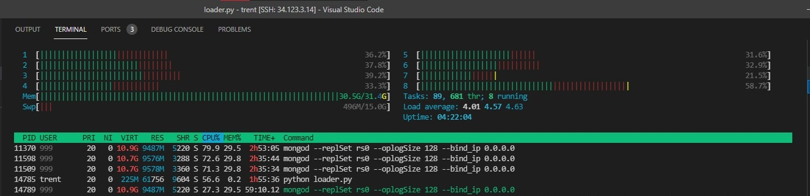

We ran these commands twice as root, first for count=5M and then count=10M to create 15GB of swap memory:
- dd if=/dev/zero of=~/swapfile.img bs=1024 count=10M
- mkswap ~/swapfile.img
- swapon ~/swapfile.img
- sudo echo '/home/trent/swapfile.img swap swap defaults 0 0' >> /etc/fstab
- cat /proc/swaps

We found these steps here: https://askubuntu.com/questions/178712/how-to-increase-swap-space

## Conflicting Python Versions

When we tried to run a user-defined function in PySpark from our jupyterlab container we got an error saying that jupyterlab was using Python 3.8.4 and the Spark workers were using Python 2.7. When we accessed the shell of the Spark workers using 'docker exec -it -u root spark-worker-1 /bin/bash' we confirmed this by running 'python --version'.

We decided the best fix was to streamline the version of Python across all docker containers to Python 3.7.7. This would also fix any future problems regarding incompatbile Python versions. The reason we decided on Python 3.7.7 was that the Spark master was using this version already, so by going with this we would have to upgrade the Spark workers and downgrade jupyterlab image's version.

Upgrading the Spark workers from 2.7 to 3.7 was straight-forward as we just add to add these environment variables.

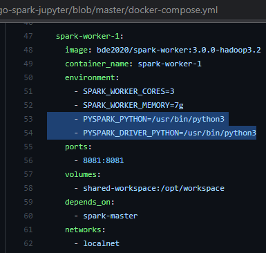

Downgrading the version inside the image jupyter/pyspark-notebook was quite difficult though. We originally tried adding in a number of different variables and a script which would execute when the container started all of which didn't work.

Eventually we found a way that we could build our own image on top of jupyter/pyspark-notebook using a script provided by the group that created the original image: 
https://jupyter-docker-stacks.readthedocs.io/en/latest/using/recipes.html#add-a-python-3-x-environment

To see this new docker image trentsteel777/pyspark-notebook-py377 see the Archive/py37env.Dockerfile.

Using this new image we were even able to make the default Python environment version 3.7.7 whenever we start a new notebook in JupyterLab, which would prevent our own human-error of accidently forgetting to set the right environment each time we started a notebook. To do this we created a new conda environment with Python 3.7.7 and set it as the default JupyterLab uses.

We then pushed this new image to dockerhub from our local laptop and then we SSH'd into our GCP VM and pulled it down onto there too.

New docker image trentsteel777/pyspark-notebook-py377: https://hub.docker.com/repository/docker/trentsteel777/pyspark-notebook-py377

## Concurrent Users

Another issue we had was when a few members of our team were trying to work on JupyterLab at once what was happening was that the first person to run a notebook would end up hogging all of the spark cluster's resources. The other users sessions would be put into WAITING status until the first session had completed.

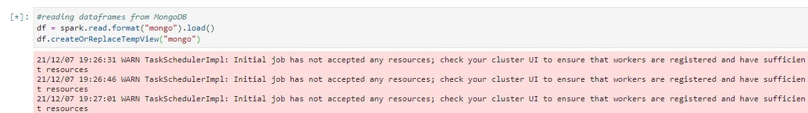

Some research suggested if we used YARN or mesos (instead of Spark Standalone mode) we could have multiple executors running on the Spark workers and that would allow a few of us to use the instance at once. However, this seemed like a lot of change at a late stage and we pushed to look for a more straightforward solution.

We discovered with a few config changes we could allow 3 people to work on the cluster at once.

What we did was add a third Spark worker into the cluster. As our GCP VM has 32GB of RAM we assigned 7GB each to the Spark workers along with access to 3 cores.

Then when we created a Spark session inside our JupyterLab Notebook, we added additional config that the executor running on the Spark worker would only be allowed a max of 7GB RAM and up to 3 cores. We also appended the first few letters of our names to the name of the executor so inside the Spark console we could see who was running what and make sure nothing was being queued up unnecessarily.

The reason we allowed the executors to take up the full amount of memory on the Spark workers was that in Spark standalone mode only 1 executor is allowed per worker anyway!

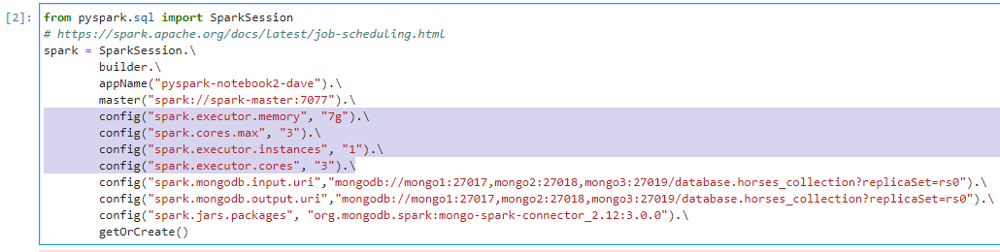

We were advised in a larger scale setup an executor could take multiple workers and that would be normal.

When we added in the config changes we could have up to three Spark session all executing at the same time.

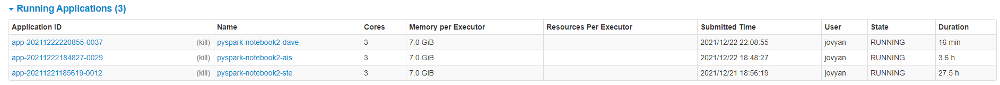

## Adding MySQL

As a final part of our project we needed to add MySQL into the cluster to store results from the Spark processing which would then be later analyzed graphed and charted.

To do this we added the following image to the docker-compose file.

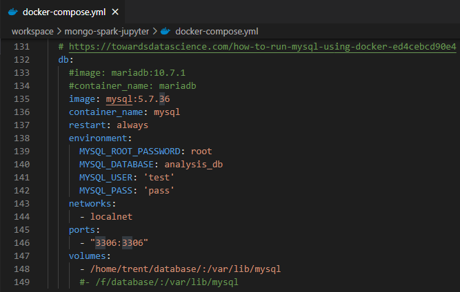

While adding in this extra component we first tried things out on our local laptop. On local, at first we weren't able to connect to this database from JupyterLab at all. 

Interestingly, we could connect straight to the database using MySQL Workbench. This told us there was no problem with the database itself but the problem lay somewhere further up the chain.

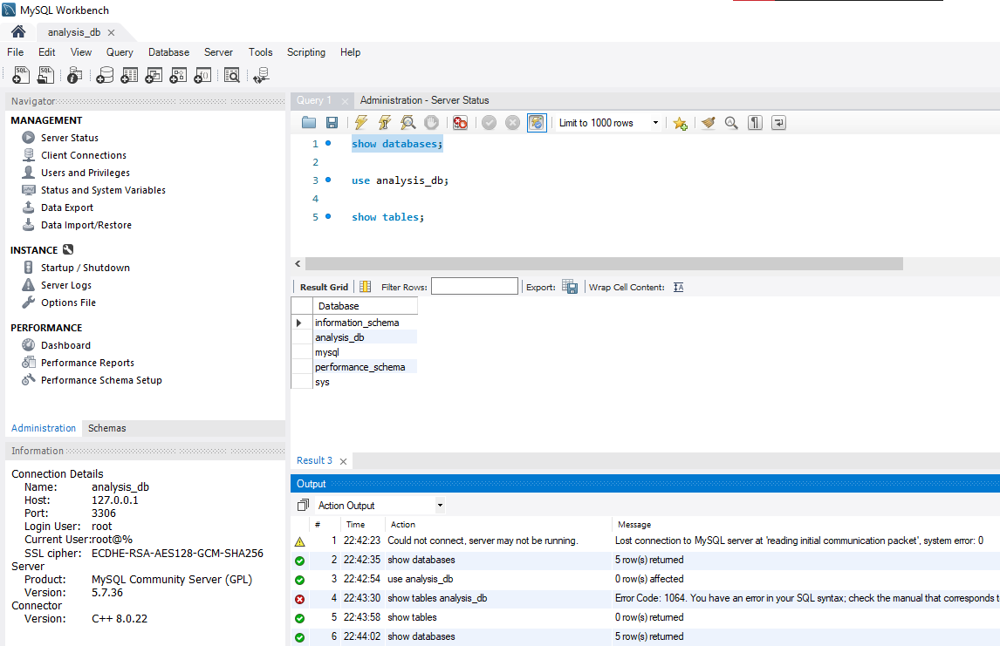

What we discovered was we needed mysql-connector-python and libmysqlclient-dev in the jupyterlab docker image.

To make this happen we first tagged trentsteel777/pyspark-notebook-py377 as 1.0.0 to checkpoint our original work and keep it safe. We pushed this tag up to dockerhub.

From here we extended Archive/py37env.Dockerfile adding mysql-connector-python and libmysqlclient-dev along with a number of other analysis and charting libraries for JupyterLab.

We then built this new image in local and tested it out. It was fantastic, we were able to connect to the database now from our new jupyterlab image:

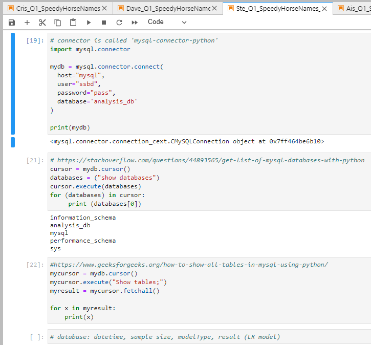

One trick was that in the examples we saw, the connection string uses localhost (host='localhost'), which didn't work for us. We spent some time trying to find the right string and we realised it was mysql (host='mysql'), as that is the name of the MySQL database docker container. As all the docker containers in our setup are on 'localnet' network they can talk to one another through the container name. So the jupyterlab container refers to mysql container to connect to the database.

Once we figured all this out we pushed trentsteel777/pyspark-notebook-py377:latest to dockerhub and then SSH'd into our GCP VM and pulled it down inside there too.

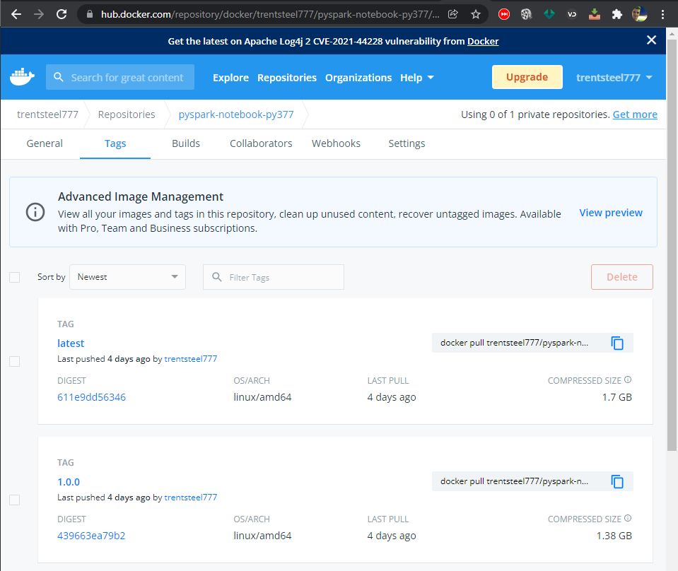

## Spark Schema Inference Issue

Another tedious issue we had at the beginning was that we were getting some sort of cast or incompatible types exception:

"com.mongodb.spark.execptions.MongoTypeConversionException: Cannot cast STRING into a DoubleType (value: BsonString{value='NaN'})"

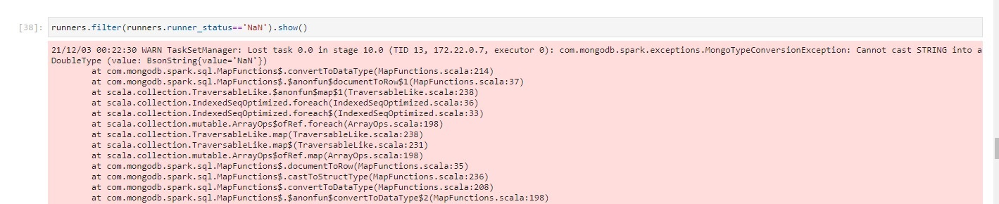

It was quite confusing at first because we thought the issue was simply that we had failed to filter any 'NaN' values out of the bsp column in the Spark dataframe.

Eventually after much research, we discovered it was nothing like that. What was in fact happening was that Spark infers the data schema at runtime (if you don't provide it one) and by default it takes a sample of 10,000 records and goes through each column and row to discover what the type of that column should be (number, string, boolean etc).

What was happening with us was that we had a big dataset and the bsp column was mostly DoubleTypes, however, in certain instances bsp column had a value of 'NaN' and the default 10,000 sampling wasn't enough to catch this. So further along in our code it thought the column was a DoubleType but would discover a StringType of 'NaN' somewhere and would have a conniption halting all further progress. 

The solution was to do 50K data sampling instead of the default 10K spark normally does. This was a large enough sampling size for Spark to discover the 'NaN' values and classify the bsp column as StringType instead of DoubleType.

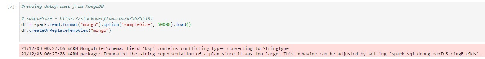

# Further work

## Docker Swarm

To take our architecture to another level we could split the containers over multiple GCP VMs and use Docker Swarm (or Kubernetes) to conduct and coordinate all of our containers.

An example would be to have the three MongoDB containers each on their own VM. This would make sense as the whole point of running a replicaSet is that if one node is taken offline the system can fall back to the other nodes and continue to function.

From there we could also move the Spark workers into their own VMs and even increase the number and power of them. If we had three powerful VMs we could have 2-3 Spark workers on each.

The Spark Master and JupyterLab containers could then each be in their own VM. The MySQL container could just sit inside the JupyterLab VM because this isn't expected to be hit with heavy traffic. 

We would also have to consider a backup of the MySQL database, as at the moment it is just a single instance with all our results from the Spark processing. So it is a single point of failure.

## Fix warnings

If we had a lot more time an area of improvement would be to investigate these wanrings that happen when we create a SparkSession and aim to fix them.

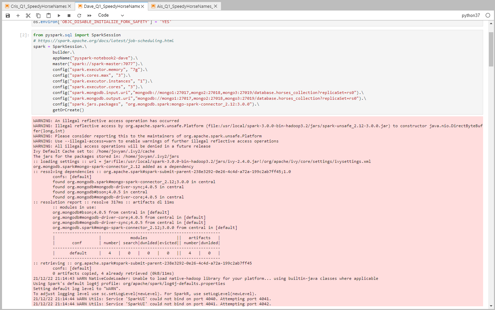