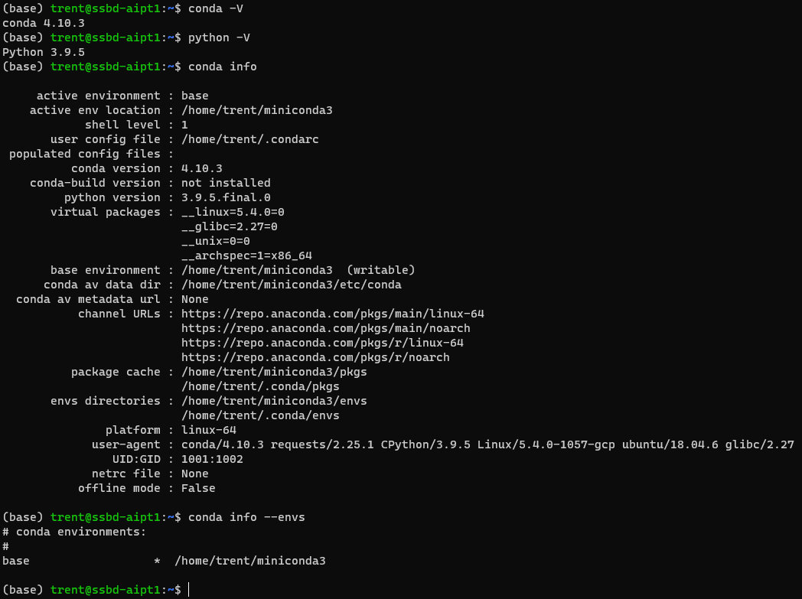

# Storage Solutions for Big Data - Group Assignment

This repo was created to provide the infrastructure for our Group Assignment for module 'Storage Solutions in Big Data' as apart of our course Higher Diploma in Artificial Intelligence (part time).

## Team members:
Name          | Student No.
------------- | -------------
Cristina Blanco  | sba20182
Stephen Brennan  | sba20180
David Fagan  | sba20183
Aisling Maher  | sba20318

# Overview

We forked from https://github.com/RWaltersMA/mongo-spark-jupyter to give us the base infrastructure.

This provided us with a 3 Spark cluster consisting of a Spark Master and 2 Spark Workers, 3 MongoDB containers and a Jupyterlab container.

The decision to fork this repo was based on the fact it used docker containers networked together and most importantly used mongodb as the database.

We needed to use mongodb as our betfair data was in json format.

## Architecture

Once we had the base architecture we added a script to load in our data, an additional spark worker (so all team members would have a worker) and another docker container for MySQL to store the results from our analysis.

As can be seen from the below, in the end we had 9 docker containers running and networked together. A future improvement might be to split this architecture over multiple VMs, such as having MongoDB containers in 1 VM, Spark containers in a 2nd VM and finally Jupyterlab and MySQL containers in a 3rd light VM.

# Why docker?

We chose docker because we knew we could have a single github repository that gave us a central place for our infrastructure files that can be easily shared.

Because docker runs on Windows, MacOS and Linux, this gave us an easy way to replicate the same environment across the teams laptops and on our production Google Cloud Platform (GCP) Virtual Machine (VM).

The alternative was VirtualBox, however, prior experience thought us that everyone might have slightly different setups across the team and there was no straightforward way to push a VirtualBox VM onto GCP.

We were able to use docker volumes to persist our notebooks, mongodb and mysql databases between docker restarts.

Our docker containers were able to communicate on our docker network 'localnet'.

# Google Cloud Platform Virtual Machine

We wanted something more powerful to run our setup on than our local laptops could provide.

We settled on GCP because of our prior knowledge, its ease of use and the $300 free starting credit Google give you.

Our GCP VM spec was: Ubuntu 18.04 LTS, 8 vCPUs, 32GB RAM, 100GB SSD. The monthly cost is ~$220.

htop

As can be seen below, the GCP VM is being pushed hard, three spark workers are using the 8 vCPUs, all the availbe RAM is consumed and the VM is now eating into the 10GB of SWAP memory we added.

On this VM we installed miniconda and docker. Within a conda environment we git cloned our repo, installed the needed libraries and used 'docker-compose up' to run our environment.

GCP conda info

Docker containers

Our GitHub repo on our GCP VM

We added two rules in our firewall to allow jupterlab running on port 8888 traffic through from external locations. We also did the same for 8080, which is the port Spark Console was running on.

Jupyterlab

Spark Console

# Loading the data

To load the data we created loader.py script.

We downloaded the horse racing for 2016 from Betfair and unzipped the file.

The unzipped folder named 'BASIC' contained a series of bz2 zipped files. 

We ran our script over these bz2 files and loaded every line, which represented a JSON object, straight into MongoDB.

We added a logger to loader.py so we could tail loader.log as the script worked to assess it's progress (tail -100f loader.log).

Link to Betfair horse racing data spec: https://historicdata.betfair.com/Betfair-Historical-Data-Feed-Specification.pdf

Even though we downloaded all available betfair horse racing data from Apr 2015 to Nov 2021, we only loaded 2016's data into mongodb. 

This was primarily because of performance concerns. 

We thought it might take too long to analyze years worth of data on the VM when we considered how long it took to analyze three months of data on one of laptops (which had 4 CPUs and 16GB of RAM).

Betfair data folders

Betfair data files

# Troubleshooting
## Image versions Issue
## Docker network
## SWAP MEMORY
## Conflicting Python Versions
change spark master and workers to use python3.7.7 (used to be 2.7), Add conda environement for jupyterlab image to include python3.7.7, out of the box it was 3.8.4 which doesnt work with pyspark udfs because there was a version mismatch with spark containers. I did this by building my own image to include a python3.7.7 environment inside the jupyterlab docker image from jupyter/pyspark-notebook:1a66dd36ff82, see: Archive/py37env.Dockerfile. This image is on dockerhub as trentsteel777/pyspark-notebook-py377:latest

## Concurrent Users
## Adding MySQL
https://hub.docker.com/repository/docker/trentsteel777/pyspark-notebook-py377
## Spark Schema Inference Issue
Major breakthrough fixing cannot convert StringType to DoubleType error. Turns out some of the bsp have a value of NaN which was throwing spark. Solution waas to do 50K data sampling instead of the default 10K spark normally does.

