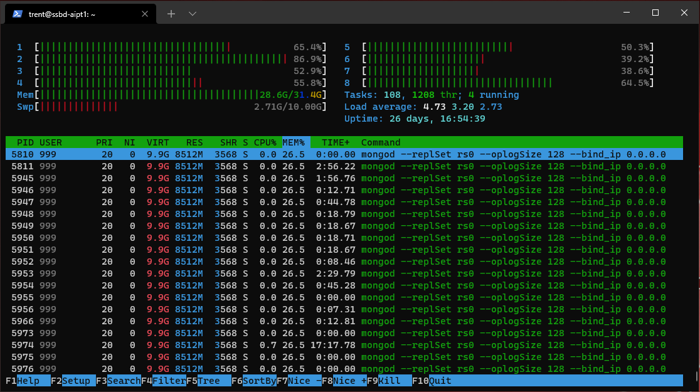

# Storage Solutions for Big Data - Group Assignment

This repo was created to provide the infrastructure for our Group Assignment for module 'Storage Solutions in Big Data' as apart of our course Higher Diploma in Artificial Intelligence (part time).

## Team members:
Name          | Student No.
------------- | -------------
Cristina Blanco  | sba20182
Stephen Brennan  | sba20180
David Fagan  | sba20183
Aisling Maher  | sba20318

# Overview

We forked from https://github.com/RWaltersMA/mongo-spark-jupyter to give us the base infrastructure.

This provided us with a 3 Spark cluster consisting of a Spark Master and 2 Spark Workers, 3 MongoDB containers and a Jupyterlab container.

The decision to fork this repo was based on the fact it used docker containers networked together and most importantly used mongodb as the database.

We needed to use mongodb as our betfair data was in json format.

## Architecture

Once we had the base architecture we added a script to load in our data, an additional spark worker (so all team members would have a worker) and another docker container for MySQL to store the results from our analysis.

# Why docker?

We chose docker because we knew we could have a single github repository that gave us a central place for our infrastructure files that can be easily shared.

Because docker runs on Windows, MacOS and Linux, this gave us an easy way to replicate the same environment across the teams laptops and on our production Google Cloud Platform (GCP) Virtual Machine (VM).

The alternative was VirtualBox, however, prior experience thought us that everyone might have slightly different setups across the team and there was no straightforward way to push a VirtualBox VM onto GCP.

We were able to use docker volumes to persist our notebooks, mongodb and mysql databases between docker restarts.

Our docker containers were able to communicate on our docker network 'localnet'.

# Google Cloud Platform Virtual Machine

We wanted something more powerful to run our setup on than our local laptops could provide.

We settled on GCP because of our prior knowledge, its ease of use and the $300 free starting credit Google give you.

# Loading the data

To load the data we created loader.py script.

We downloaded the horse racing for 2016 from Betfair, unzipped the file.

The unzipped folder named 'BASIC' contained a series of bz2 zipped files. 

We ran our script over these bz2 files and loaded every line, which represented a JSON object, straight into MongoDB.

# Troubleshooting
## Image versions Issue
## Docker network
## SWAP MEMORY
## Conflicting Python Versions
## Concurrent Users
## Adding MySQL
https://hub.docker.com/repository/docker/trentsteel777/pyspark-notebook-py377

